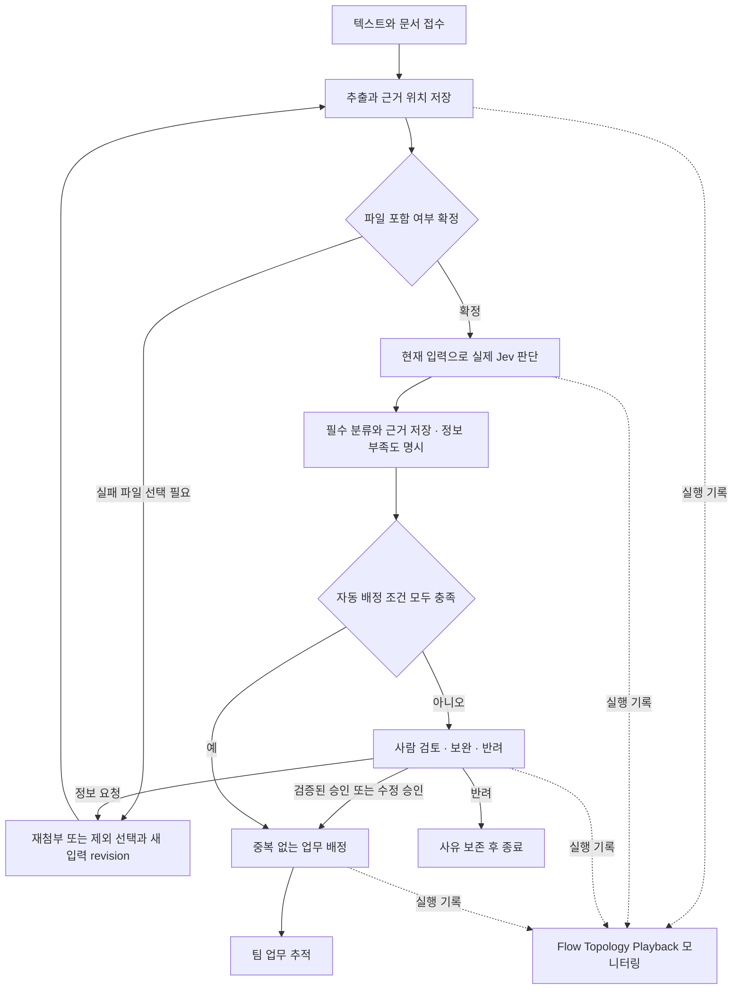

# Jev Triage PRD

작성일: 2026-10-02 (Asia/Seoul) · 버전: 0.2 · 상태: 설계 리뷰 7건 반영, 구현 준비

이 문서는 [원 요구사항](docs/spec/README.md)을 실행 가능한 제품 범위로 정리한다. 완료 판정은 [06_ACCEPTANCE](docs/spec/06_ACCEPTANCE.md), 측정 정의는 [05_SLO](docs/spec/05_SLO.md)가 우선한다. 디자인은 [HANDOFF](docs/design-handoff/HANDOFF.md)를 따른다. 실행 계획은 [TASK](TASK.md)에 연결한다. 이 문서 작성은 제품 개발 완료나 요구사항 승인·축소를 의미하지 않는다.

리뷰 후 확정한 배정·동시성·관측·측정 규칙은 [실행 계약](docs/architecture/EXECUTION_CONTRACT.md)에 정의한다. 설계 수정과 실제 구현 검증 상태를 구분한다.

## 1. 문제와 목표

현업이 요청한 업무를 곧바로 AI 개발 과제로 취급하면 일반 개발로 충분한 일과 사람의 결정이 필요한 일이 섞이고, 담당과 승인 책임이 불명확해진다. Jev Triage는 요청과 문서를 근거로 AI 필요성, 개발 가능성, 긴급도, 담당 조직을 판단하고, 필요한 사람 검토를 거쳐 실행 가능한 내부 업무로 연결한다.

사용자는 판단 결과뿐 아니라 원문 근거, 불확실성, 처리 과정, 사람의 수정과 현재 업무 상태를 확인할 수 있어야 한다. 자동 처리율 상승 자체를 성공 목표로 삼지 않는다. 분류 품질, 승인 안전성, 업무 책임의 명확성과 실제 처리 신뢰성을 함께 검증한다.

## 2. 사용자와 접근 범위

| 사용자 | 주요 목적 | 접근 원칙 |
| --- | --- | --- |
| 요청자 | 요청·첨부 제출, 보완, 판단과 진행 확인 | 본인 및 명시적으로 허용된 조직 요청만 조회·보완 |
| 검토자 | 원문과 판단 비교, 승인·수정·반려·정보 요청 | 지정된 조직/요청의 검토 권한, 승인 이전 배정 통제 |
| 팀 담당자 | 주관·협업 업무 및 선행 조건 확인, 상태 변경 | 배정된 조직 업무에 한해 허용된 전이 수행 |
| 운영자 | 오류·Trace·정책·복구 관리 | 정책 편집과 운영 조회 권한 분리; 운영자라는 이유만으로 모든 원문 공개 금지 |

권한은 서버의 인증된 사용자·조직·역할에 의해 결정한다. 브라우저가 보낸 역할, 문서의 지시, WebMCP 호출자는 권한 부여의 근거가 아니다. 교차 조직 협업은 명시적 공유 범위를 가진다.

## 3. 첫 버전 범위

### 필수

- 텍스트 및 PDF·DOCX·MD 복수 첨부를 하나의 요청으로 접수한다.
- 원문 위치가 있는 추출 텍스트와 대화 보완 이력을 보존한다.
- 실제 Jev 판단을 저장하고 AI·일반 기술·사람의 업무 분담을 제시한다.
- 승인·수정 승인·반려·정보 요청과 변경 이력을 제공한다.
- 내부 업무 생성, 주관·협업, 선행 관계와 팀별 상태를 추적한다.
- Dynamic Config 정책 버전·검증·감사·되돌리기와 Neo4j 관계 조회를 제공한다.
- SSE 진행·복구, 실제 기록 기반 Flow·Topology·Playback·모니터링을 제공한다.
- 지원 브라우저에서 WebMCP 조회 도구를 실행하고 미지원 환경에서도 웹 기능을 유지한다.
- 역할·조직 경계, 입력 제한, 장애 복구, 성능·분류 품질을 검증한다.

### 기본 범위에서 제외

- SAP 운영 시스템 직접 변경, 외부 티켓/메일/메신저에 업무를 실제 발행하는 기능.
- 규제 준수 인증 또는 임상·안전·규제 전문 승인 대행.
- OCR: 첫 버전은 텍스트 추출 가능한 PDF만 지원한다. 스캔 PDF는 명시적으로 보완을 요청한다.
- WebMCP 쓰기 도구. 외부 연동 확장은 별도 범위·권한을 정한다.

실연동을 모의 응답으로 바꿔 필수 기능을 완료 처리하지 않는다. 단계별 구현은 개발 순서이며 최종 범위 축소가 아니다.

## 4. 핵심 사용자 흐름

실제 시스템 오류는 보완·검토 대기와 별도 상태로 표시한다. 부분 실패를 성공으로 숨기지 않는다. 재분석은 새 실행이며 이전 판단을 보존한다. 업무가 이미 배정된 요청은 재분석만으로 기존 업무를 변경하거나 중복 생성하지 않는다.

지원 범위 입력의 업무 정보가 부족해도 사용자의 추가 답변을 기다리기 전에 현재 입력의 실제 판단을 저장한다. 정보 부족·판단 보류와 그 근거가 있는 완전한 기록만 사람 검토 가능한 최초 판단으로 인정한다. 단순 추가 질문·대기 상태 변경·모델 실패는 최초 판단 완료가 아니다.

## 5. 기능 요구사항과 인수 기준

| ID | 요구사항 | 관찰 가능한 인수 기준 | 게이트 |
| --- | --- | --- | --- |
| R01 | 접수와 영속 조회 | ID 발급 전에 지속 가능한 접수 상태 저장; 재시작 후 요청·검토·업무·Trace 조회 | G01 |
| R02 | 첨부와 원문 연결 | 형식별 실제 내용 반영; PDF 페이지/문단, DOCX 문단, MD 행 위치; 손상·초과·암호화·스캔 입력 안내 | G02, G11 |
| R03 | 파일 부분 실패와 보완 | 실패한 파일과 누락 영향 표시; 사용자 제외 선택 또는 재첨부 이후만 진행; 과거 결과 보존 | G02, G03 |
| R04 | 핵심 판단 | 아래 분류값, 조건·장애·재판단 조건, 실제 신뢰 신호와 정책/모델/질문/스키마 버전 저장 | G03 |
| R05 | 근거와 업무 초안 | 결정별 확인 가능한 원문 근거; 업무별 방식·주관·협업·선행·산출물; 없는 근거를 합성하지 않음 | G03, G05 |
| R06 | 사람 검토 | 승인·수정 승인·반려·정보 요청, 결정자·시각·사유·이력; AI 원안과 최종 결과 비교 | G04 |
| R07 | 배정과 팀 추적 | 자동 배정 조건 전부 검증; 검토 필요 요청은 승인 전 배정 0건; 최신 실행/초안에 한한 승인·배정 단일 트랜잭션; 동시 승인/반복 클릭/재시도 중복 0건 | G05, G11 |
| R08 | 정책 관리 | 스키마 검증·변경 사유·버전·diff·되돌리기; 필수 검토 해제 거절; 실행 시작 정책 고정; 과거 결과 변경 없음 | G06 |
| R09 | 실제 그래프 | 요청→판단/업무→팀 및 업무 선행 관계를 Neo4j에 저장·조회하고 화면에 연결 | G06, G07 |
| R10 | SSE | 이벤트 ID·재연결·누락 보정; 영속 상태와 최종 화면 일치, 재시작 중 처리 복구 | G08 |
| R11 | 실행 관찰 | 요청별 실제 단계/분기/병렬/재시도, 상태·시각·버전·오류·근거를 노드에서 조회 | G07, G09 |
| R12 | Playback | 재생/정지/처음부터/속도/이동/전체 결과; 실패·건너뜀·사람 대기 정확; 재호출·배정 부작용 0건 | G07 |
| R13 | 모니터링과 알림 | DB와 독립된 실패·분모 기록; 기간·조직·상태·버전 필터; 실제 집계와 Trace/attempt 진단 대조; 수집 누락 공개·오류 예산·소진/수집 중단 알림 | G09, G12, G13 |
| R14 | WebMCP 조회 | 지원 환경의 요청 검색/상세/Trace 실제 실행과 서버 권한 검사; 미지원 웹 동작 유지 | G10, G11 |
| R15 | 보안과 데이터 처리 | 조직/역할 밖 조회·승인 차단, 악성 문서 무효화, 키/원문 로그 보호, 저장 장애의 거짓 성공 방지 | G11 |
| R16 | 사용성과 디자인 | 키보드 주요 흐름, 상태 아이콘+이름, 44px 터치, 반응형, 움직임 감소·Safari 매체 대체 | G02, G04, G07 |
| R17 | 품질과 성능 | 아래 시험 범위와 원문 SLO의 분모·실패 표본 기준 충족 | G12 |
| R18 | 운영 판정과 제출물 | G01–G12 증거 보고서와 실행/복구 문서; G13은 연속 30일 별도 보고 | G01–G13 |

### 판단 결과 계약

| 판단 | 지원 값 / 필수 정보 |
| --- | --- |
| AI 필요성 | 필요·불필요·혼합·정보 부족; AI 적용 부분과 일반 기술로 충분한 부분 |
| 개발 가능성 | 가능·조건부 가능·현재 불가·정보 부족; 기술 가능성, 조직 여건, 승인 여부를 구분 |
| 긴급도 | 긴급·일반·판단 보류; 업무 영향·기한의 원문 근거 |
| 조직 | AI팀·IT팀·현업의 주관·협업 집합; 업무별 책임 |
| 처리 방식 | AI·일반 기술·사람; 순서·선행 작업·산출물 |
| 검토 필요 | 정책상 이유, 불확실성, 필요한 추가 정보, 책임 검토자 |

Jev Choice·Score confidence와 Noul의 참일 확률을 같은 값으로 취급하지 않는다. confidence는 정확도 보장이 아니다. Jev가 출력하지 않은 설명·인용·업무명은 Jev 결과로 표시하지 않는다. 원문 추출, 규칙, 생성 모델 또는 검토자 중 실제 작성 주체를 기록한다. 문서 내용은 데이터로만 취급한다.

### 자동 배정 허용 조건

아래 조건을 모두 충족해야 한다. 서버에서 [실행 계약 1절](docs/architecture/EXECUTION_CONTRACT.md#1-자동-배정과-필수-검토)의 조건표를 검증한다.

| 항목 | 자동 배정 허용 기준 |
| --- | --- |
| 입력·버전 | 문서 포함/제외가 확정되고 최신 입력/실행/초안의 판단과 근거 저장 완료 |
| 가능성·정보 | 개발 가능성 `가능`; 미해결 전제·정보 부족·판단 보류·담당 미정 없음 |
| 업무·신호 | 초안의 근거/조직/선행 관계 유효; 실제 신호가 타입별 정책 기준 충족 |
| 위험·정책 | 임상·안전성/약물감시·규제/인허가·긴급 또는 위험 미확정에 해당하지 않음; 고정 정책에서 자동 배정 허용 |
| 정합성 | 기존 배정 없음; 검토 및 배정 버전/권한/유일성 검증 통과 |

필수 검토와 무승인 배정 금지는 정책 게시·되돌리기로 해제할 수 없다. 조건부 가능·현재 불가·정보 부족은 높은 confidence라도 자동 배정하지 않는다. 검토 승인 후에도 해결되지 않은 본업무의 전제는 시작 차단 조건으로 보존한다.

## 6. 화면과 디자인

| 화면 | 필수 동작 |
| --- | --- |
| Main / ChatWidget | 채팅·첨부·업로드/분석 구분·부분 실패 선택·보완·판단 카드·원문 근거·이전 실행 비교 |
| Review | 검토 목록·AI 원안 비교·담당 조정·4종 결정·동시 변경 충돌·이력 |
| Tasks | 팀/방식/주관·협업/상태 필터·선행 작업·배정 전 초안과 실제 업무 구분 |
| Observatory | 실행 Flow / 업무 Topology / 서비스 Topology·Trace 상세·Playback·별도 재실행 |
| Monitoring | 실제 집계·지연·검토 대기·SLO·오류 예산·수집 상태·원인 Trace·알림 |
| Policy | 검증된 초안·diff·버전·변경 사유·되돌리기·진행 중 실행 정책 고정 안내 |

토큰과 일동이 에셋을 재사용한다. Primary `#F15921` 위 글자는 `#1B1712`, Secondary `#0E7C86` 위에는 흰 글자를 사용한다. 긴급·시스템 실패 결과에는 마스코트를 사용하지 않는다. 960px 이하 메뉴 반응형, ChatWidget 520px 이하 전체 화면, reduced-motion 정지 이미지, Safari WebP 대체를 검증한다. 정적 화면의 예시 수치·confidence·ID는 실제 데이터로 복사하지 않는다.

## 7. 입력 범위와 SLO

지원 한도는 요청당 텍스트 합계 20,000자, 첨부 5개, 파일당 10MiB/합계 25MiB, 텍스트 PDF 파일당 50페이지다. 추출 합계 초과 시 조용한 자르기 대신 명시적으로 거절하거나 보완 상태로 전환한다. 파일 선택·업로드 시간과 서버 수신 이후 처리시간을 분리한다.

| 지표 | 목표 |
| --- | --- |
| 접수·조회 가용성 | 30일 ≥99.9% |
| 최초 판단 저장 신뢰성 | 지원 범위 접수 중 120초 내 성공, 30일 ≥99.0% |
| 접수 응답 지연 | p95 ≤2초 |
| 텍스트 / 첨부 최초 판단 지연 | p95 ≤15초 / ≤45초 |
| 상태 반영 / SSE 복구 | p95 ≤2초 / ≤5초, 최종 상태 누락 0건 |
| Trace 완전성 | 개발 시험 100%, 운영 ≥99.9% |
| AI 필요성·가능성·긴급도 품질 | 각각 macro-F1 ≥0.85 |
| 긴급 재현율 / 담당 팀 집합 평균 F1 | ≥0.95 / ≥0.85 |
| 무승인 배정·권한 밖 접근·중복 업무 | 필수 안전 시험 0건 |

개발 시험은 예열 후 **30분, 활성 요청 10개, SSE 20개, 유효 요청 200건 이상**, 텍스트/PDF/DOCX/MD **50/25/15/10%**로 수행한다. 같은 지연 목표 및 가용성 99.9%·최초 판단 성공률 99.0% 기준을 적용한다. 실패·시간초과 표본을 포함하며 판단 미도달은 120초 실패 표본으로 계산한다. 부하 거절을 분모에서 제외하지 않는다. 사람 검토 대기와 반려는 시스템 실패와 구분한다.

최초 요청의 시작 시각·분모는 보완·재시도로 초기화하지 않는다. 지원 범위의 정보 부족 요청도 필수 판단·근거가 실제 저장돼야 최초 판단 성공이다. 이후 사람의 답변 대기는 별도로 측정하고, 보완 revision의 재판단 지연은 별도 실행 지표로 보고한다. 기존 120초 실패를 후속 성공으로 지우지 않는다. 손상/초과/미지원 입력의 제외 사유와 건수는 공개하며 지원 입력의 파서/모델/DB 장애를 입력 오류로 재분류하지 않는다. 상세 규칙은 [05_SLO](docs/spec/05_SLO.md#보완재실행과-측정-단위)를 따른다.

한국어 현업 검토 표본 100개 이상을 확보하고 최종 평가 60개 이상을 고정해 튜닝과 분리한다. 정보 부족·혼합·조건부·긴급 사례, 클래스별 수·오분류·검토 전환·자동 처리율·confidence 구간별 정확도를 보고한다. 정답을 구현자가 임의 확정하거나 평가 문장만 하드코딩하지 않는다.

## 8. 데이터·정책·실행 불변 조건

- 요청과 재분석 실행을 별도 식별한다. 각 실행은 입력 revision, 정책·질문·스키마·모델 버전을 고정한다.
- AI 원안, 검토자 수정, 승인된 업무, 오류 및 실행 기록을 구분해 보존한다.
- worker 인계마다 소유권 generation을 증가시킨다. 결과·이벤트·heartbeat 쓰기는 트랜잭션 내 잠금과 owner/generation/미만료 검증을 거치며 만료 worker의 뒤늦은 쓰기를 거절한다.
- 검토는 request/input revision/run/초안/검토 버전에 묶는다. 과거 대상 승인은 충돌로 거절한다. 검토 결정·배정·관계·감사·이벤트는 한 트랜잭션으로 저장하고 요청당 첫 배정의 유일성을 보장한다.
- Neo4j 장애 때도 독립 관측 journal과 수집기가 요청 분모·실패·지연을 보존하고 복구 후 대조한다. 관측 누락 구간은 정상 수치로 채우지 않는다.
- SSE와 Playback은 영속 실행 기록을 사용한다. 중복/역순 이벤트로 업무 상태가 역행하지 않는다.
- 원문/추출 텍스트/증거/Trace/모델 전송본 모두 같은 권한 경계를 적용한다.
- 외부 모델에는 승인된 전송 범위의 최소·마스킹된 텍스트만 보낸다. 실제 정보보호·보존 기준과 모델 공급자 계약 확인 전 민감 실데이터를 데모에 사용하지 않는다.
- 보존 기간·삭제/백업 정책은 설정과 감사로 관리한다. 확정되지 않은 운영 보존 기간을 제품 보장으로 쓰지 않는다.

## 9. 준비 상태와 미확정 사항

2026-10-02 확인 결과:

| 항목 | 상태 | 다음 조치 |
| --- | --- | --- |
| 저장소 | `b301b45`, 요구사항·디자인만 존재 | 실행 코드·테스트·명령은 TASK에서 구현 |
| 개발 전제 | Python/FastAPI/문서 파서와 로컬 Neo4j 도구 시험 통과 | 제품 시험과 구분; 구현 의존성은 저장소에서 고정 |
| JEV_API_KEY | 환경 주입 확인, 사용자 제공 설정 재사용 | 값 출력/브라우저 전달/중복 키 요청 금지 |
| Jev 공식 문서 | 이번 작업에서 접근 성공 | 공식 API/모델/SDK를 T02 계약에 반영 |
| Jev API | 모델 목록 조회가 proxy CONNECT 403에서 차단 | `api.typesafe.ai` 허용 적용 후 재검증; 인증 실패로 단정하지 않음 |
| 디자인 | 정적 6화면 및 에셋 존재, Observatory 정적 링크 404 | 원본을 실제 Observatory 화면으로 구현 |
| 한국어 품질 | 미검증 | 현업 정답 표본·최종 평가 확보 |
| WebMCP | 실제 브라우저 호환성 미검증 | M0의 T00에서 실제 지원/미지원 환경 사전 확인; T20 제품 통합 |
| 요약·업무 분해 | Jev 텍스트 생성 범위 밖 | T03에서 근거 기반 구현 방식 결정; 필요 시 생성 모델 요건만 추가 |
| 운영 인증·보존·배포 | 아직 정해지지 않음 | 개발 역할 시험은 진행, 운영 출시 전에 정식 설정 확정 |

문서로 확인한 Jev 계약: `POST https://api.typesafe.ai/v1/systemone`, `state/model/questions`, 응답 `model/answers/usage`. Python 패키지는 `typesafe-sdk`, import는 `typesafe_sdk`, 기본 키 이름은 `TYPESAFE_API_KEY`다. 프로젝트는 기존 **JEV_API_KEY를 서버에서 명시적으로 SDK에 전달**한다. 키 이름 변경이나 복제를 요구하지 않는다. 문서의 현재 버전 `jev-1.13.0`은 실제 접근 확인 후 고정하고 응답 모델을 별도로 기록한다. 가격·한도는 계약 시 재확인하며 제품 SLO 보장으로 인용하지 않는다.

공식 자료 확인일: 2026-10-02. [API](https://docs.typesafe.ai/api), [모델](https://docs.typesafe.ai/models), [Python SDK](https://docs.typesafe.ai/sdk/python), [WebMCP 초안](https://webmachinelearning.github.io/webmcp/).

## 10. 완료와 변경 관리

G01–G12가 실제 증거로 모두 통과하면 개발 완료다. G13은 실제 배포 후 연속 30일의 트래픽·분모·오류·수집 상태를 포함한 운영 보고서로 별도 판정한다. 모의 환경의 통과를 실연동 게이트 통과로 옮기지 않는다.

모든 완료 보고서에는 통과·실패·미검증·차단 상태, 증거 경로, 실행 ID, 코드/정책/모델 버전과 날짜를 붙인다. 필수 결과 또는 수치 변경은 근거·비용·사용자 영향을 제시하고 제품 책임자의 승인 기록을 남긴다. 구현 세부 선택은 TASK의 기술 결정을 통해 진행한다.
