<div align="center">

# Jev Triage · 일동이

**업무 요청 한 문장에서, 근거 있는 판단과 실행 가능한 업무까지.**


[빠른 시작](#빠른-시작) · [주요 기능](#주요-기능) · [아키텍처](#아키텍처-요약) · [문서](#문서-색인)

</div>

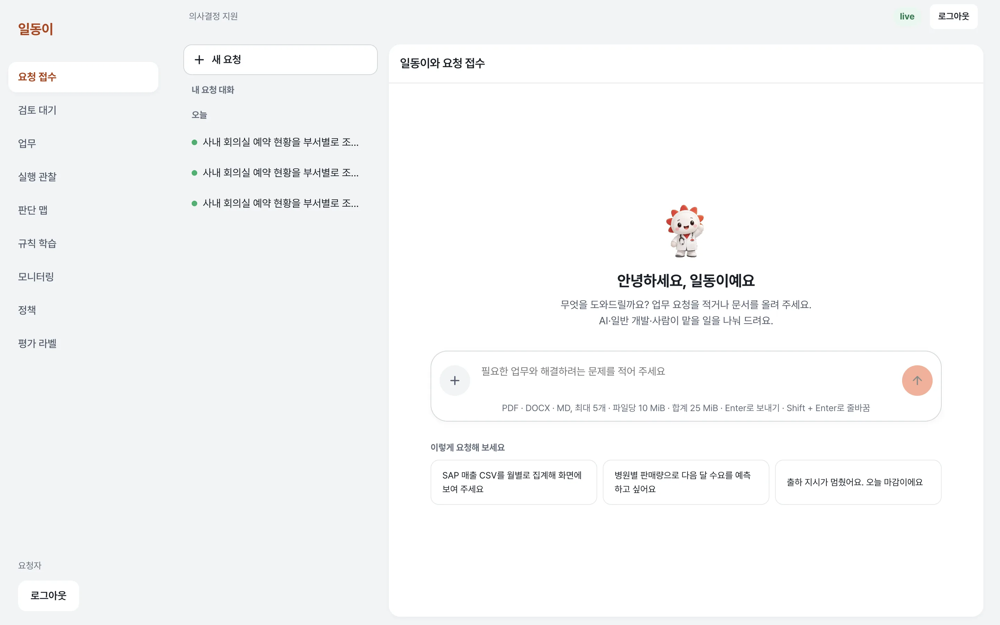

## 무엇을 하나요

- **말로 시작하는 업무 접수.** 일동이에게 요청을 적거나 PDF·DOCX·Markdown을 첨부하세요. 대화 목록에서 진행 중인 요청을 다시 찾을 수 있습니다.
- **기다림을 줄이는 판단.** 잠정 결과부터 보여 주고, Jev의 판단·원문 근거·업무 분해를 최종 카드로 연결합니다. 정보가 부족하면 판단을 보류합니다.
- **사람이 책임지는 실행.** 검토자가 원문과 AI 원안을 비교하고 승인·수정·보완·반려합니다. 확정된 업무는 담당 조직과 선행 관계에 따라 추적합니다.
- **수정이 쌓이는 학습.** 검토 이력을 규칙 후보로 모으고, 범위 결정·섀도 검증·게시·효과 관찰로 이어 갑니다. 정책과 판단의 버전도 함께 남습니다.

## 주요 기능

### 잠정 판단에서 최종 요약까지

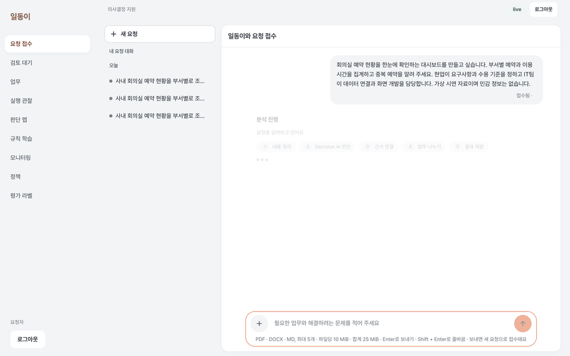

> 실제 LIVE 응답에서 캡처한 상태를 짧게 이어 붙인 GIF입니다. 재생 길이는 실제 응답 시간을 나타내지 않습니다.

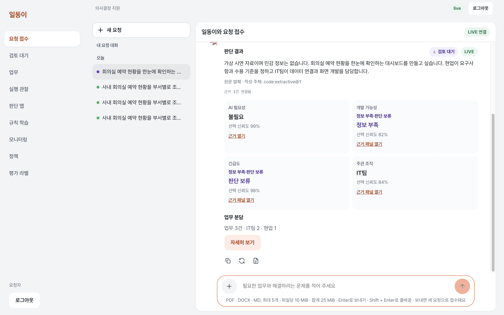

### 검토하고, 실행하고, 개선하기

| 원문을 보며 검토 | 담당 업무를 추적 |
| --- | --- |
| 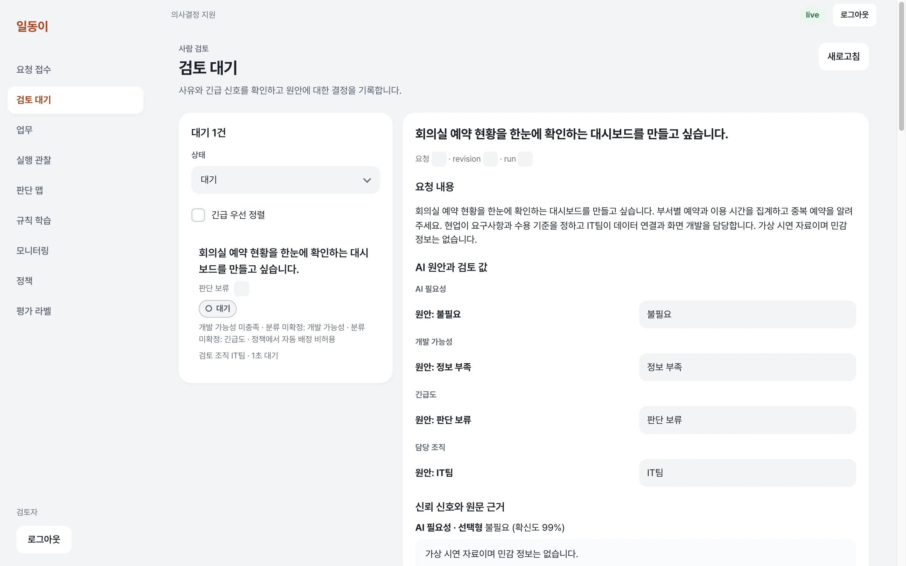 | 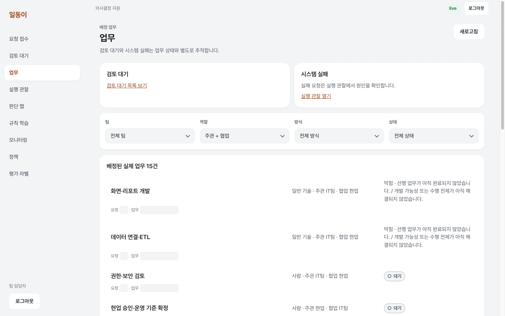 |
| 요청 제목·원문·AI 원안을 한 화면에서 비교합니다. 수정 사유와 승인 이력을 보존합니다. | 승인 후 생성된 업무와 선행 조건을 확인하고 상태를 전이합니다. |
| **판단의 연결을 탐색** | **수정 이력을 규칙으로** |
| 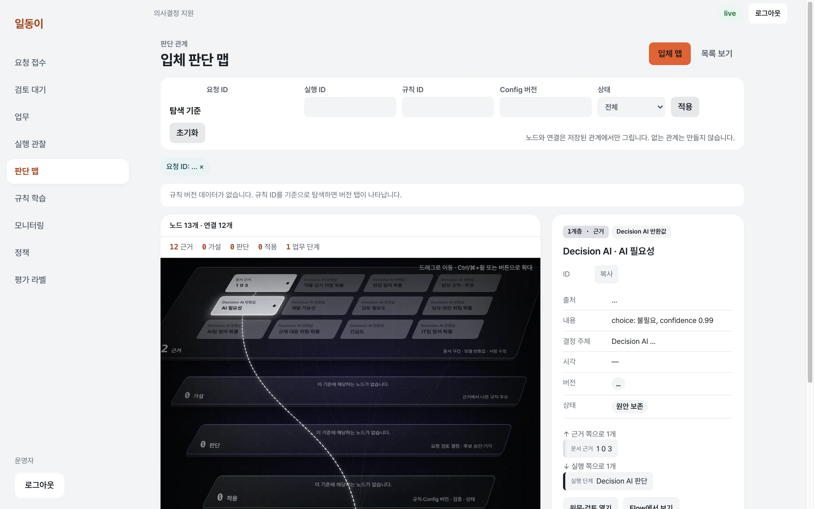 | 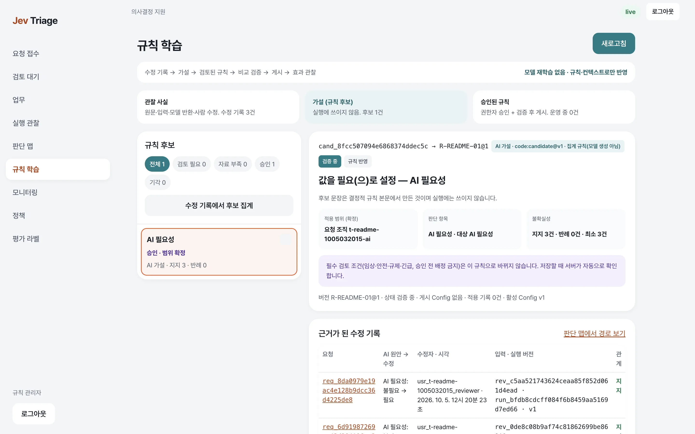 |
| 판단 맵에서 요청·판단·근거·업무·규칙의 관계를 따라갑니다. | 지지 사례·반례·적용 범위를 확인합니다. 표본이 부족하면 그 한계를 표시합니다. |
| **정답을 쌓는 평가** | **흐름을 확인하는 모니터링** |
| 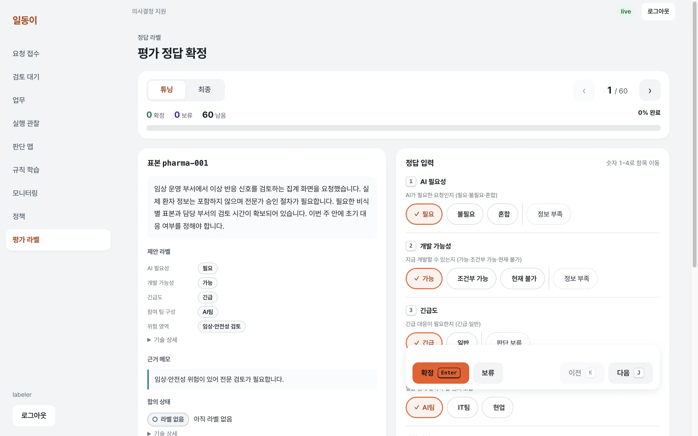 | 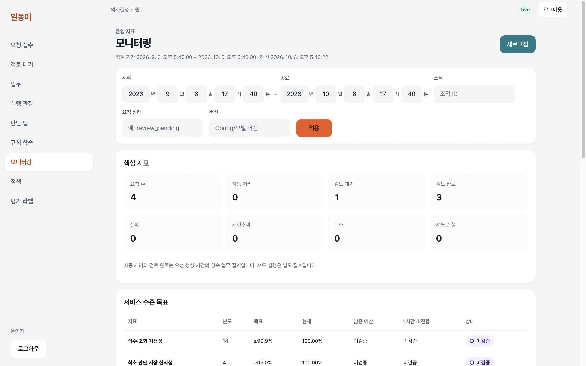 |
| 라벨 칩과 키보드 단축키로 표본을 검토하고 정답을 확정합니다. | 접수·검토·배정, 지연·오류·알림을 필터링해 확인합니다. |

<details>
<summary><strong>정책 폼 · 다크 모드 · 모바일 화면 펼치기</strong></summary>

정책은 폼에서 편집하고 서버 검증을 거칩니다. 게시 사유·버전·차이·되돌리기를 관리하며, 기존 실행은 당시 정책 버전을 유지합니다.

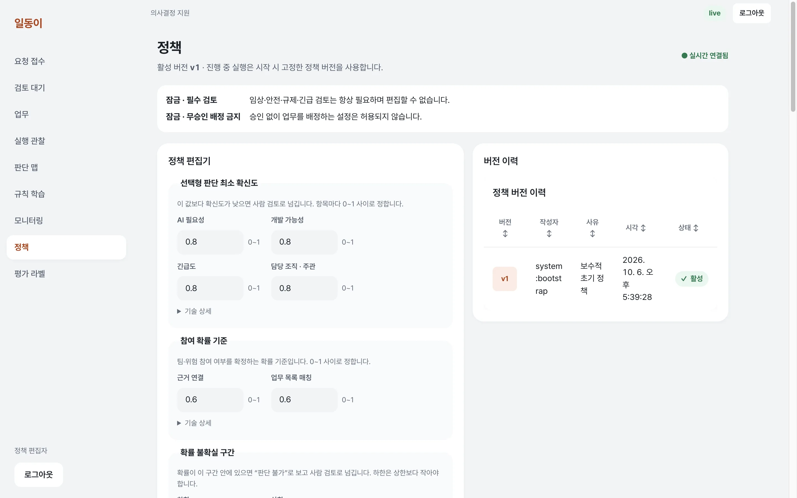

시스템의 색상 설정에 맞춰 채팅·목록·카드가 함께 바뀝니다.

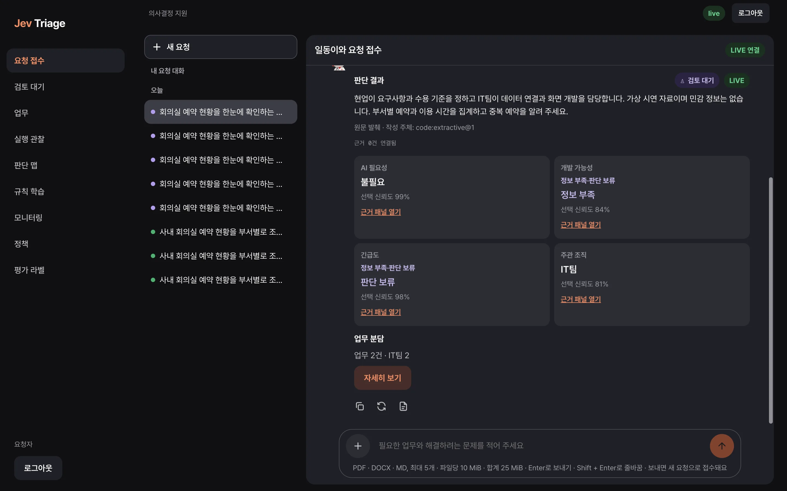

| 모바일 채팅 · 375px | 모바일 검토 · 375px |
| --- | --- |
| 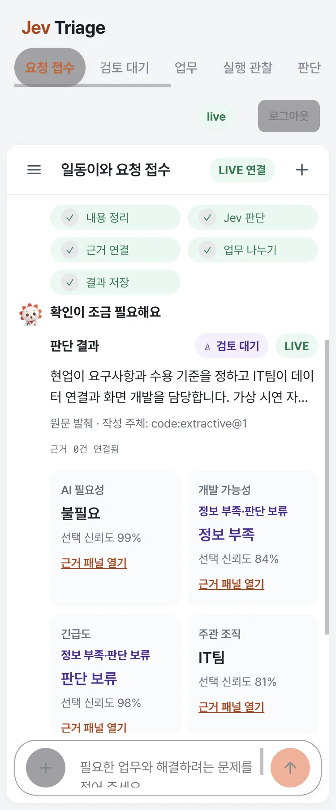 | 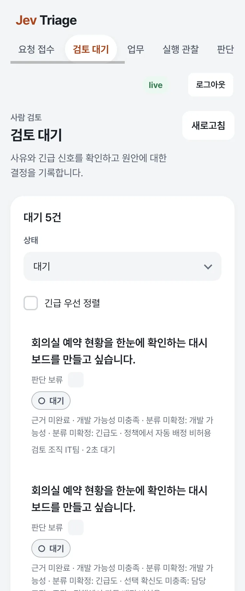 |

</details>

화면은 격리된 시연 tenant와 가상 업무 입력으로 촬영했습니다. LIVE 판단·수정 이력·업무는 실제 저장 결과이며, 계정명과 일부 기술 식별자만 촬영 시 가렸습니다. [촬영·검증 기록](docs/readme/REPORT.md) · [재촬영 방법](scripts/readme/README.md)

## 동작 흐름

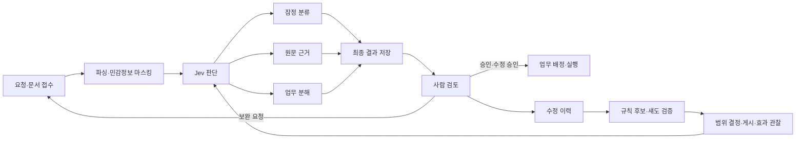

잠정 결과는 확정된 업무 배정이 아닙니다. 검토·정책·권한 경계를 통과한 결과만 다음 단계로 진행합니다. 세부 계약은 [점진 결과](docs/architecture/PROGRESSIVE_RESULTS.md), [검토·배정](docs/architecture/REVIEW_ASSIGN.md), [학습 루프](docs/spec/08_LEARNING_LOOP.md)를 참고하세요.

## 아키텍처 요약

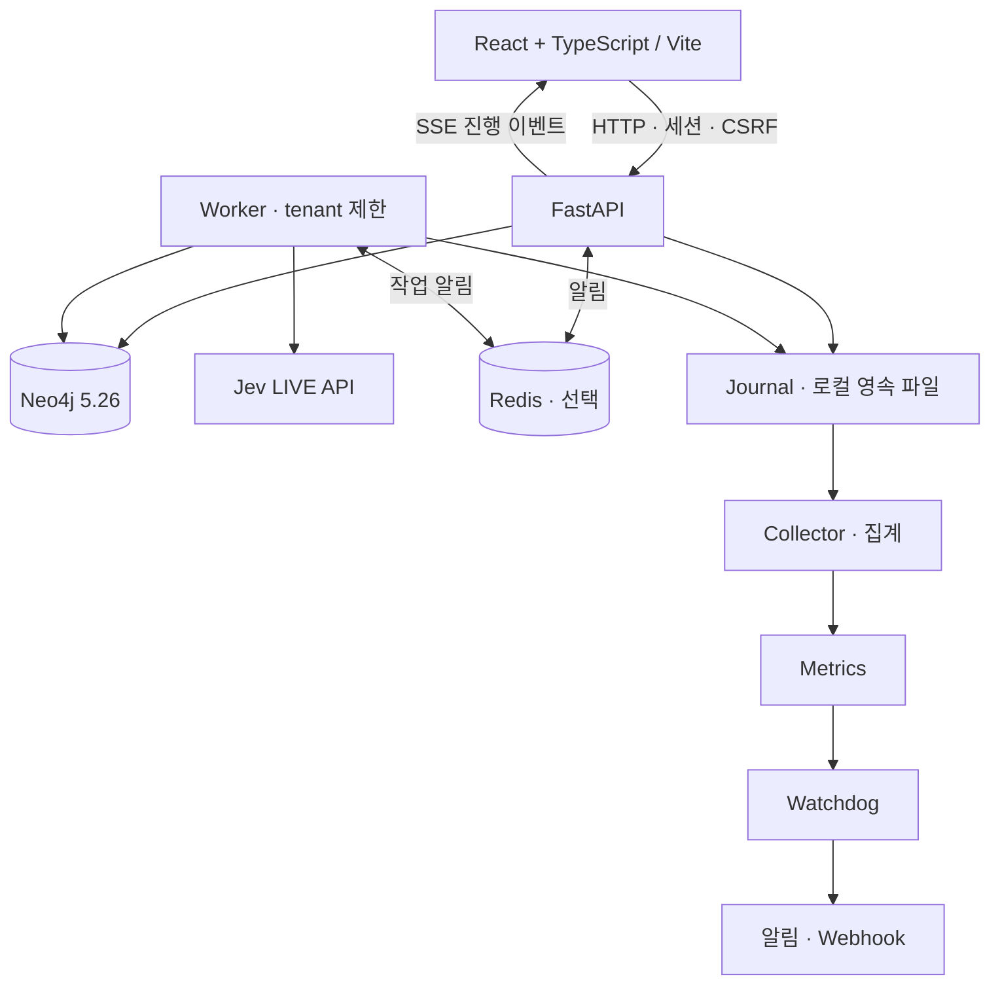

Neo4j에 요청·실행·판단·검토·업무·이벤트를 저장합니다. Redis는 알림을 앞당기며, 재연결과 누락 보정의 기준은 Neo4j의 영속 이벤트입니다. API·Worker·Collector·Watchdog는 **동일한 절대 `DATA_DIR`**를 사용해야 합니다.

[아키텍처 전체 보기 · HTML](docs/architecture/ARCHITECTURE_OVERVIEW.html) · [데이터 모델](docs/architecture/DATA_MODEL.md) · [실행 계약](docs/architecture/EXECUTION_CONTRACT.md)

## 빠른 시작

### 1. 준비와 설치

Python **3.14**, Node.js **22**와 npm, **OrbStack의 Docker Engine·Compose v2**, Unix 계열 셸과 의존성 설치용 네트워크가 필요합니다. macOS에서는 OrbStack을 실행한 뒤 아래 명령을 사용합니다.

```sh
# 실제 저장소 주소로 바꾸세요.
git clone <repository-url> decision-chat-bot
cd decision-chat-bot

docker context use orbstack
docker info
cp .env.example .env
python3.14 -m venv backend/.venv
(cd backend && .venv/bin/pip install -e . --group dev)
npm --prefix frontend ci
```

기존 작업 디렉터리라면 clone·가상환경 생성·`.env` 복사를 생략합니다. **기존 `.env`를 덮어쓰지 마세요.** `.env`에 `JEV_API_KEY`를 넣고 아래 설정을 확인하세요. 이 파일은 로컬 비밀 설정이며 커밋하지 않습니다.

### 2. 데이터베이스와 개발 계정

```sh
make up
# 선택: Redis 알림을 사용할 때만
# docker compose up -d redis

(cd backend && .venv/bin/python -m jevtriage.db.schema)
backend/.venv/bin/python scripts/bootstrap_dev.py
```

기본 계정은 `requester@t-alpha.dev`, 암호는 `dev-only-change-me`입니다. 검토·업무·운영·정책·학습·평가는 각각 `reviewer`, `team_member`, `operator`, `policy_editor`, `rule_admin`, `labeler`를 이메일 앞부분에 사용합니다. 외부에 노출된 개발 환경에서는 **계정 생성 전** `JEVTRIAGE_DEV_PASSWORD`를 설정하세요. bootstrap은 기존 계정 암호를 재설정하지 않습니다.

### 3. 설정

| 키 | 목적 | 기본·주의 |
| --- | --- | --- |
| `JEV_API_KEY` | 서버의 Jev LIVE 호출 | 비밀. 비어 있으면 LIVE 판단 불가 |
| `NEO4J_URI` | Neo4j Bolt 주소 | `bolt://localhost:7687` |
| `NEO4J_USER` | Neo4j 사용자 | `neo4j` |
| `NEO4J_PASSWORD` | Neo4j 암호 | 개발 기본 `development-only`; 운영에서는 교체 |
| `JEV_MODE` | 모델 연결 | `live` 또는 명시적 로컬 시험용 `mock`; 결과에도 모드 보존 |
| `DATA_DIR` | 원본·journal·metrics·알림 | 기본 `.data`는 프로세스 작업 디렉터리 기준. 아래처럼 절대 경로 권장 |
| `REDIS_URL` | 선택적 이벤트·작업 알림 | 기본 비어 있음. 로컬 Redis 사용 시 `redis://127.0.0.1:6379/0` |
| `MONITORING_WEBHOOK_URL` | Watchdog 알림 수신 주소 | 선택값. 비밀 URL 취급, `.env.example`에 없는 코드 지원 설정 |

전체 설정은 [설정 목록](docs/operations/CONFIG.md)을 참고하세요. `JEV_MODE=mock`은 장애 시험 등 명시적인 로컬 시험에서만 사용하며, mock 결과는 LIVE 연동·인수 증거가 아닙니다. LIVE·mock 모두 민감한 실데이터로 시연하지 않습니다.

### 4. 실행과 중지

아래 명령은 **각각 별도 터미널**에서 실행합니다. 모든 터미널은 저장소 루트에서 동일한 `DATA_DIR`를 설정하세요.

```sh
export DATA_DIR="$PWD/.data"
make api        # http://localhost:8000
make worker     # 별도 터미널; 시험에서는 tenant를 반드시 제한
make collector  # 별도 터미널
make watchdog   # 별도 터미널
make web        # 별도 터미널; http://localhost:5173
```

시험·E2E용 worker는 아래처럼 전용 tenant로 제한합니다. 같은 개발 데이터베이스에 여러 worker를 띄울 때는 각자의 범위를 확인하세요.

```sh
(cd backend && .venv/bin/python -m jevtriage.jobs.worker --tenant t-alpha)
# 또는 WORKER_TENANTS=t-alpha make worker
curl --fail http://localhost:8000/api/health
curl --fail http://localhost:8000/api/ready
```

Vite가 `/api` 요청을 API로 프록시합니다. 종료는 각 터미널에서 **Ctrl-C**로 API·Worker·Collector·Watchdog·Vite를 먼저 정리합니다. Worker는 새 Job 수신을 멈추고 진행 중 작업을 정리합니다. 이 저장소의 컨테이너를 혼자 사용할 때만 `make down`으로 종료하세요. **공유 Neo4j를 사용하는 다른 시험이 있으면 중지하지 않습니다.** [운영 Runbook](docs/operations/RUNBOOK.md)에 재시작·복구 절차가 있습니다.

## 개발·시험 명령

저장소 루트 기준입니다. LIVE 시험은 자격 증명·비용·입력 관리 지침을 먼저 확인하고 전용 tenant를 사용하세요.

| 목적 | 명령 |
| --- | --- |
| 백엔드 전체 시험 | `(cd backend && .venv/bin/pytest -q)` |
| Ruff | `(cd backend && .venv/bin/ruff check jevtriage tests)` |
| 계층·순환 의존성 | `(cd backend && .venv/bin/lint-imports)` |
| 전체 린트 | `make lint` |
| Vitest | `npm --prefix frontend run test` |
| TypeScript | `npm --prefix frontend run typecheck` |
| 프로덕션 빌드 | `npm --prefix frontend run build` |
| 백엔드 + 프런트 시험 | `make test` |
| Playwright | `(cd frontend && npx playwright install chromium && npm run e2e)` |
| 별도 Neo4j 장애 시험 | `make test-fault` |
| LIVE 인수 시험 | `make test-acceptance` |
| LIVE 품질 평가 | `backend/.venv/bin/python eval/runner.py --split tuning --max-samples 60 --concurrency 2 --retries 1` |
| README 링크·용량 검증 | `backend/.venv/bin/python scripts/readme/verify.py` |

`make typecheck`·`make build`도 같은 프런트 검사 명령을 실행합니다. Playwright의 서버·계정 조건은 [E2E 안내](frontend/e2e/README.md), 품질 평가는 [평가 안내](eval/README.md), 장애 주입은 [장애 시험 설계](docs/architecture/FAULT_TESTS.md)를 따릅니다. E2E가 시작한 API·tenant 제한 worker·Vite는 시험 후 모두 종료합니다.

<details>
<summary><strong>백업·복원 명령</strong></summary>

독립된 백업 Compose 프로젝트와 비어 있는 복원 경로를 사용합니다. 실제 사용 전 [백업·복원 절차](docs/operations/BACKUP_RESTORE.md)를 확인하세요.

```sh
make backup BACKUP_DIR=/secure/path/backup-id \
  COMPOSE_PROJECT=jevtriage-backup NEO4J_CONTAINER=jevtriage-backup-neo4j-1 \
  NEO4J_BOLT_PORT=7689 NEO4J_DATA_DIR="$PWD/.data/neo4j" DATA_DIR="$PWD/.data"
make restore BACKUP_DIR=/secure/path/backup-id RESTORE_DATA_DIR=/srv/jevtriage-restored \
  COMPOSE_PROJECT=jevtriage-backup NEO4J_CONTAINER=jevtriage-backup-neo4j-1 NEO4J_BOLT_PORT=7689
```

</details>

## 디렉터리 구조

```text
backend/             FastAPI · 도메인 서비스 · Neo4j · Worker · pytest
frontend/            React + TypeScript · Vite · Vitest · Playwright
docs/spec/           요구사항 · 사용자 경험 · SLO · 인수 · 학습 루프
docs/architecture/   실행 계약 · 데이터 모델 · API · 설계 문서
docs/operations/     운영 · 설정 · 데이터 처리 · 백업·복원
docs/readme/         README 전용 화면·GIF와 검증 기록
scripts/demo/        연속 시연 영상 녹화
scripts/readme/      격리 환경 시드 · 화면 촬영 · 압축 · 검증
scripts/ops/         운영·백업 도구
scripts/fault/       장애 주입 시험
eval/                품질 평가 데이터·실행기
loadtest/            부하 시험
artifacts/           시연·검증·감사 증거
```

## 문서 색인

| 읽고 싶은 내용 | 문서 |
| --- | --- |
| 제품 목표·범위 | [요구사항](docs/spec/01_GOALS_REQUIREMENTS.md) · [사용자 경험](docs/spec/02_USER_EXPERIENCE.md) · [명세 색인](docs/spec/README.md) |
| 품질과 인수 조건 | [SLO](docs/spec/05_SLO.md) · [인수 기준](docs/spec/06_ACCEPTANCE.md) |
| 구조와 실행 | [전체 아키텍처](docs/architecture/ARCHITECTURE_OVERVIEW.html) · [구현 안내](docs/architecture/IMPLEMENTATION.md) · [실행 계약](docs/architecture/EXECUTION_CONTRACT.md) · [데이터 모델](docs/architecture/DATA_MODEL.md) |
| 접수·판단·검토 | [접수 API](docs/architecture/INGEST_API.md) · [Jev 계약](docs/architecture/JEV_CONTRACT.md) · [판단 설계](docs/architecture/JUDGMENT_DESIGN.md) · [검토·배정](docs/architecture/REVIEW_ASSIGN.md) |
| 실행 관찰·맵 | [관찰 API](docs/architecture/OBSERVE_API.md) · [판단 그래프](docs/architecture/JUDGMENT_GRAPH.md) · [이벤트 복구](docs/architecture/EVENTS.md) |
| 학습·평가 | [학습 루프](docs/spec/08_LEARNING_LOOP.md) · [후보](docs/architecture/LEARNING_CANDIDATES.md) · [검증](docs/architecture/LEARNING_VALIDATION.md) · [규칙](docs/architecture/LEARNING_RULES.md) · [평가 라벨](docs/architecture/EVALUATION_LABELS.md) |
| 정책·접근성 | [정책](docs/architecture/POLICY.md) · [인증](docs/architecture/AUTH.md) · [디자인 시스템](docs/architecture/DESIGN_SYSTEM.md) · [접근성](docs/architecture/A11Y.md) |
| 운영 | [Runbook](docs/operations/RUNBOOK.md) · [백업·복원](docs/operations/BACKUP_RESTORE.md) · [데이터 처리](docs/operations/DATA_HANDLING.md) · [배포 전 확인](docs/operations/DEPLOYMENT.md) · [설정](docs/operations/CONFIG.md) |

## 시연 영상

로그인 → 일동이 접수 → 잠정·최종 판단 → 사람 검토 → 업무 → 판단 맵 → 학습·평가·정책까지 이어지는 시연은 [챕터 안내](artifacts/demo/20261004T143022Z/chapters.md)에서 확인하세요. 영상 파일은 로컬에 보관하며, GitHub README에는 위의 경량 화면과 GIF만 포함합니다. 새 영상은 [녹화 안내](scripts/demo/README.md)에 따라 생성할 수 있습니다.

## 상태·한계

**개발·검증용 애플리케이션이며, 운영 배포 승인 아님.**

- **G10 — 외부 브라우저 에이전트:** 실제 WebMCP 에이전트 연동 검증 대기.
- **G12 — 현업 정답과 품질:** 현업 정답 데이터와 충분한 표본의 품질 검증 대기.
- **G13 — 운영 관측:** 30일 운영 요건 검증 대기.
- 개발 인증은 bootstrap 계정입니다. 운영 인증 공급자·비밀 관리·원격 관측 수집·알림 수신자·보존 및 삭제 정책·장애복구 목표·배포 보안 검토는 별도 확정과 검증이 필요합니다. 로컬 Watchdog만으로 호스트 전체 유실을 감지할 수 없습니다.
- 캡처의 학습 규칙은 전용 시연 범위의 **초안**입니다. 화면의 수치나 소수 LIVE 사례를 운영 품질·성능의 보장으로 해석하지 않습니다.

[게이트 검증 기록](artifacts/validation/final/GATE_REPORT.md) · [운영 전제와 제한](docs/operations/DEPLOYMENT.md#운영-전-확정할-사항) · [T26 검증 기록](artifacts/validation/t26/README.md)
