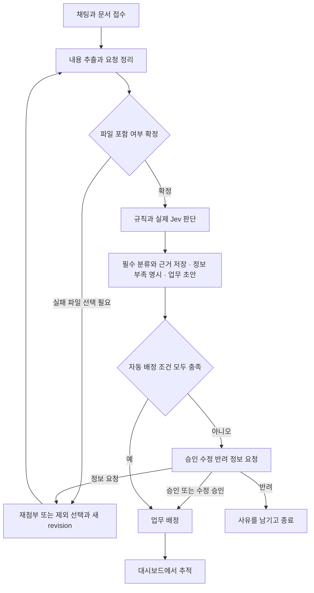
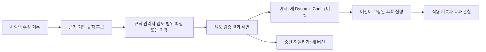

# 사용자 경험과 업무 흐름

## 접수부터 배정까지

다이어그램은 개념 흐름이다. 실제 실행은 병렬 처리나 재시도를 포함할 수 있으며 화면은 실제 기록을 반영한다.

지원 범위 입력에서 업무 정보가 부족한 경우에도 현재 입력의 실제 판단을 먼저 기록하고 보완을 요청한다. 모든 필수 분류·근거·부족 정보가 저장돼 검토 가능한 경우에만 최초 판단 완료로 센다. 담당이나 업무를 알 수 없으면 미정과 그 사유를 표시하며 추측해 채우지 않는다. 추가 질문만 표시하거나 모델 오류를 보완 상태로 바꾸는 것은 판단 완료가 아니다. 보완·재실행의 시간/분모는 [05_SLO](05_SLO.md#보완재실행과-측정-단위)에 따른다.

## 요청자

채팅에 요구를 입력하고 파일을 첨부한다. 업로드와 분석 진행을 구분해서 보여 준다. 결과에는 한 줄 요약, 핵심 판단, 담당 조직, 업무 분담, 추가 정보, 검토 여부가 포함된다. 각 판단에서 원문 페이지·문단 등 근거 위치를 열 수 있어야 한다.

첨부 중 일부가 읽히지 않으면 어느 파일에 문제가 있는지 알리고, 나머지로 분석할지 재첨부할지 선택하게 한다. 중요한 내용이 누락된 채 완전한 분석처럼 표시하지 않는다. PDF가 스캔 이미지이면 OCR로 처리하거나 읽을 수 없는 이유와 텍스트 제공 방법을 안내한다. OCR 지원 범위는 시작 전에 문서화한다.

추가 정보를 제출하거나 재분석할 때 이전 결과는 보존한다. 결과가 변경된 이유와 실행 버전이 식별되어야 한다.

## 검토자

검토 대기 목록에서 요청, 원문 근거, 판단, 신뢰 신호, 업무 분담을 함께 확인한다. 승인·수정·반려·추가 정보 요청 후 누가 언제 무엇을 바꿨는지 남는다. 승인 전 배정이 허용되지 않는 요청은 배정되지 않는다. 동시 검토나 반복 클릭으로 승인과 업무가 중복 생성되지 않아야 한다.

## 담당 팀과 운영자

팀별 업무와 상태, 주관·협업 관계, 막힌 선행 작업을 확인한다. 운영자는 실패 요청과 지연 단계에서 해당 Trace로 이동하고, 정책을 변경하거나 허용된 재시도를 수행한다. “검토 대기”와 “시스템 실패”를 다른 상태로 보여 준다.

## 화면 구성의 자유

채팅, 결과, 업무 대시보드, Flow/Topology, 모니터링, 정책 관리, 입체 판단 맵, 규칙 학습이라는 경험은 필요하다. 이를 별도 페이지, 탭 또는 하나의 작업 화면으로 구성할지는 에이전트가 정한다. 키보드로 주요 기능을 사용할 수 있고 색상만으로 상태를 구별하지 않는다.

## 수정 비교부터 규칙 적용까지

검토자는 요청별 AI 원안과 자신의 수정값을 항목별로 비교하고, 근거 구간과 수정 사유를 확인한다. 승인·수정 승인은 해당 요청의 `ReviewDecision`으로 기록되며, **단건 검토의 수정 승인은 공통 규칙 게시 승인이 아님**을 명확히 안내한다. 원안은 덮어쓰지 않는다.

규칙 관리자는 규칙 학습 화면에서 근거와 지지 사례·반례가 연결된 후보, 적용 범위와 불확실성을 검토한다. 범위를 확정하거나 기각 사유를 남기고, 섀도 검증 결과를 확인한 뒤 검증된 후보만 게시할 수 있다. 게시·중단·되돌리기는 새 Dynamic Config 버전으로 기록되며 각각 감사 이력을 남긴다. 진행 중 실행은 시작 시 고정한 버전을 유지하고 과거 기록은 바뀌지 않는다.

운영자와 검토자는 입체 판단 맵에서 실제 관계를 따라 업무 단계에서 근거 원문까지, 근거에서 후속 판단·규칙·실행까지 양방향 추적한다. 노드 선택 시 상세 패널과 권한에 따른 원문 이동을 제공하고, 그래프와 같은 데이터를 계층별 목록 보기로도 제공한다. 저장되지 않은 중간 관계를 화면에서 만들어 연결하지 않는다.

화면 번호 09는 **입체 판단 맵**, 화면 번호 10은 **규칙 학습**이다. 두 화면은 Flow·Topology와 같은 식별자로 연결한다.
