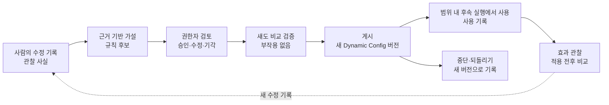

# 확장 설계: 수정 경험의 규칙화와 입체 판단 맵

작성일 2026-10-03 · 상태: 설계 확장, 구현·검증 전

이 문서는 기존 00–07 문서와 [실행 계약](../architecture/EXECUTION_CONTRACT.md)을 **대체하지 않고 확장**한다. 기존 기능·기술 방향·실행 계약·안전 조건·SLO 수치·G01–G13 게이트는 그대로 유지한다. 이 문서의 확장 요구 R19–R26, 확장 게이트 X01–X10, 확장 작업 T29–T38은 다른 문서가 같은 ID로 참조하는 기준이다.

## 1. 추가하는 순환

다음 세 종류의 정보는 저장·화면·API 모두에서 구별한다.

| 구분 | 의미 | 실행 영향 |
| --- | --- | --- |
| 관찰 사실 | 원문 구간, 입력 revision, 실제 모델 반환값, 사람의 수정 기록 | 없음 (기록) |
| 가설 (규칙 후보) | 수정 기록에서 도출한 개선 제안. AI 제안 또는 사람 제안 | **없음** — 실행에 사용하지 않음 |
| 승인된 규칙 | 규칙 관리자가 승인·검증·게시한 규칙 버전 | 게시된 Config 버전을 고정한 실행에서만 사용 |

요청 한 건에 대한 검토자의 수정 승인은 그 요청의 결정일 뿐이며 **공통 규칙의 게시 승인이 아니다.**

이 확장은 **모델 재학습이 아니다.** Jev나 생성 모델의 가중치를 바꾸지 않는다. 승인된 규칙은 (a) Jev 호출 전후의 결정적 규칙(라우팅·검토 전환·값 보정), 또는 (b) Jev state에 넣는 검증된 컨텍스트로만 반영된다. 화면과 기록에 반영 방식을 `규칙` 또는 `컨텍스트`로 표시하고 "모델이 학습했다"고 표현하지 않는다.

## 2. 확장 요구 (R19–R26)

| ID | 요구 | 관찰 가능한 인수 기준 | 게이트 |
| --- | --- | --- | --- |
| R19 | 수정 기록과 원안 비교 | 검토 결정 트랜잭션에서 판단 항목별 AI 원안·수정값·근거(원문 span/검토 사유)·수정자·시각·input revision·run·Config 버전을 `Correction`으로 저장; Review·Learning에서 전후 비교; 원안은 덮어쓰지 않음 | X01 |
| R20 | 규칙 후보 제안 | 수정 기록 집합에서 분류·담당 조직·검토 전환·개발 가능성 등의 후보를 생성; 후보마다 지지 사례·반례·적용 범위·불확실성·출처(AI 가설/사람 제안, 생성 주체·버전)를 연결; 최소 표본 미달은 `자료 부족`으로 표시하고 효과를 주장하지 않음 | X02 |
| R21 | 규칙 검토와 권한 | 후보 승인·범위 수정 후 승인·기각(사유 필수); 검증·게시·중단·되돌리기; 역할별 권한과 감사; 단건 검토 승인으로 규칙 상태가 바뀌지 않음 | X03 |
| R22 | Config 연결과 실제 적용 | 게시는 새 Dynamic Config 버전 생성; 실행 시작 시 고정한 버전의 규칙만 사용; 범위 일치 실행마다 `RuleApplication`(사용·범위 밖 미사용·충돌로 미적용, 규칙 버전, 변경 전후 값) 기록; 필수 검토·무승인 배정 금지를 약화하는 규칙은 저장·게시·되돌리기 모두 거절 | X05, X07 |
| R23 | 부작용 없는 비교 검증 | 기준 Config 버전과 후보 버전으로 과거 입력을 섀도 실행; 업무·배정·검토 대상·알림·사용자 이벤트·최신 결과 포인터 변경 0건; 비교 조건(기간·범위·버전)·표본 수·정답 표본 수 저장 | X04 |
| R24 | 규칙 효과 관찰 | 적용 전후·사용/미사용 집단의 분류 변경, 사람 수정 비율, 검토 전환, 실패·지연을 표본 수와 함께 표시; 최소 표본 미달이면 `관찰 중·표본 부족`으로 효과 미확정; 기존 SLO 분모를 바꾸지 않음 | X09 |
| R25 | 판단 관계 저장 | 근거→가설→판단→적용→업무 단계 관계를 Neo4j의 실제 노드·관계로 저장·조회; 존재하지 않는 중간 관계를 합성하지 않음; 같은 tenant·권한 경계 적용 | X06, X08 |
| R26 | 입체 판단 맵 | 5계층 깊이 배치·연결선·선택 경로 강조·상세 패널·양방향 추적·원문 이동·확대/축소/이동/전체 보기·요청/규칙/버전/상태 필터·대규모 관계 축약·키보드/작은 화면 목록 보기; Flow·Topology·Learning과 같은 ID로 상호 이동 | X06 |

## 3. 판단 관계 모델

구체적인 라벨·속성 이름은 T29에서 확정하되 의미는 유지한다. 모든 노드는 `tenant_id`, 생성 시각, 생성 주체(사람 ID 또는 모델/규칙 이름·버전)를 가진다.

| 계층 | 노드 | 내용 |
| --- | --- | --- |
| 1 근거 | `EvidenceSpan` | 첨부/대화의 원문 구간(파일·페이지·문단/행·해시), input revision |
| 1 근거 | `ModelOutput` | 실제 Jev 반환값(질문·값·confidence/확률 필드 그대로)·모델 버전·run |
| 1 근거 | `Correction` | 판단 항목별 AI 원안→수정값, 사유, 수정자, 시각, review/run/revision/Config 버전 |
| 2 가설 | `RuleCandidate` | 후보 문장, 판단 항목, 제안 범위, 출처(AI/사람)·생성 모델 버전, 상태(제안·검토 필요·자료 부족) |
| 3 판단 | `RuleDecision` | 승인·범위 수정 승인·기각, 결정자, 사유, 확정 범위, 시각 |
| 3 판단 | `ReviewDecision` | 기존 요청 단건 검토 결정(승인·수정 승인·반려·정보 요청) |
| 4 적용 | `RuleVersion` | 규칙 ID(예: `R-ROUTE-07`)와 버전, 효과(규칙/컨텍스트), 범위, 상태(검증 중·게시·중단·되돌림), 포함된 `ConfigVersion` |
| 4 적용 | `ValidationRun` | 섀도 비교 검증(기준·후보 Config, 조건, 표본, 결과 요약) |
| 5 업무 단계 | `RunStep` | 규칙/판단을 읽은 실제 실행 단계(run·step ID, 상태, 시각) |

| 관계 | 의미 |
| --- | --- |
| `(ModelOutput)-[:CITES]->(EvidenceSpan)` | 판단 근거 위치 (근거 계층 내부) |
| `(Correction)-[:CORRECTS]->(ModelOutput)`, `(ReviewDecision)-[:RECORDED]->(Correction)` | 사람 수정의 출처 |
| `(RuleCandidate)-[:SUPPORTED_BY {role:'support'|'counter'}]->(Correction|EvidenceSpan)` | 지지 사례·반례 |
| `(RuleDecision)-[:DECIDES]->(RuleCandidate)` | 후보에 대한 결정 |
| `(RuleVersion)-[:DERIVED_FROM]->(RuleDecision)` | 승인된 결정에서 만든 규칙 버전 |
| `(RuleVersion)-[:PUBLISHED_IN]->(ConfigVersion)`, `(ValidationRun)-[:VALIDATES]->(RuleVersion)` | 정책 버전 연결과 검증 |
| `(RunStep)-[:APPLIED {outcome, before, after}]->(RuleVersion)` | 실행 단계의 규칙 사용 (`RuleApplication`) |
| `(RunStep)-[:USED_OUTPUT]->(ModelOutput)` | 실행 단계가 사용한 판단 |

가설을 거치지 않은 근거(예: 단건 수정만 있고 후보가 없는 경우)는 근거 계층에 그대로 남고 연결선이 없다. 화면은 빈 계층을 빈 상태로 보여 주며 가상의 노드나 관계를 만들지 않는다. 양방향 추적은 위 관계 유형만 따라가는 경로 질의(Neo4j quantified path pattern 등)로 수행하고 깊이와 결과 수를 제한한다.

## 4. 규칙 수명과 권한

| 상태 | 진입 | 실행 영향 |
| --- | --- | --- |
| 제안 / 검토 필요 / 자료 부족 | 후보 생성 | 없음 |
| 기각 | 규칙 관리자, 사유 필수 | 없음, 기록 보존 |
| 승인 (범위 확정) | 규칙 관리자, 범위 수정 가능 | 없음 |
| 검증 중 → 검증 완료 | 섀도 비교 실행 | 없음 |
| 게시 | 검증 완료 후 규칙 관리자, 새 Config 버전 | 게시 이후 **시작한** 실행부터 |
| 중단 / 되돌림 | 규칙 관리자, 새 Config 버전으로 기록 | 이후 시작한 실행부터 미사용; 진행 중 실행은 시작 시 버전으로 완료 |

| 동작 | 권한 |
| --- | --- |
| 후보 제안 | 검토자 이상 (AI 후보는 서비스가 생성) |
| 후보 승인·범위 수정·기각 | 규칙 관리자 |
| 검증·게시·중단·되돌리기 | 규칙 관리자 (각 동작 감사 기록) |
| 조회 | 해당 tenant·조직 범위의 검토자/운영자; 원문 근거는 기존 원문 권한을 따름 |

검증하지 않은 후보는 게시할 수 없다. 게시·중단·되돌리기는 모두 새 Config 버전이며 과거 버전·과거 실행의 `RuleApplication`과 결과를 수정하지 않는다. 규칙 저장·게시 시 서버가 [실행 계약 1절](../architecture/EXECUTION_CONTRACT.md#1-자동-배정과-필수-검토)의 불변 조건(임상·안전·규제·긴급·위험 미확정 필수 검토, 무승인 배정 금지, 불가/정보 부족 자동 배정 금지)을 약화하는지 검사하고 약화하면 거절한다. 규칙은 더 엄격한 검토 전환을 추가할 수는 있다.

## 5. 섀도 비교 검증과 효과 관찰

- 섀도 실행은 별도 실행 종류(`shadow`)로 저장하고 업무·배정·검토 큐·알림·사용자 SSE·요청의 최신 결과 포인터를 쓰지 않는다. 이 경계는 코드 경로와 시험(실행 전후 업무·배정·이벤트 수 비교)으로 보장한다.
- 기본 비교는 저장된 판단 반환값에 기준/후보 규칙만 다시 적용하는 **재평가**로 수행한다. 컨텍스트 반영 규칙처럼 모델 호출이 필요한 경우에만 Jev를 다시 호출하며, 호출 수·비용을 기록하고 상한을 둔다.
- 결과 요약: 대상 기간·범위·Config 버전, 전체 표본 수, 사람 확정 정답이 있는 표본 수, 분류 변경 수, 사람 수정 필요(정답 대비) 변화, 검토 전환 변화, 실패·지연 변화.
- 효과 판정 상태는 `개선 확인`·`일부 확인`·`변화 없음`·`악화`·`관찰 중·표본 부족` 중 하나다. 최소 표본 기준은 T35에서 Dynamic Config의 검증된 값으로 정하고 화면에 표시한다. 기준 미달이면 `관찰 중·표본 부족` 외의 판정을 내리지 않는다.
- 규칙 효과 지표는 기존 SLO와 별도 지표이며 05_SLO의 수치·분모를 변경하지 않는다. 섀도 실행은 SLO의 요청·판단 분모에 포함하지 않고 별도로 공개한다.

## 6. 입체 판단 맵과 다른 관찰 화면

| 화면 | 표현하는 관계 |
| --- | --- |
| Flow (04) | 한 실행의 단계 순서·분기·재시도 |
| Topology (04) | 요청·업무·팀·서비스 관계 |
| 입체 판단 맵 (09) | 판단의 근거→가설→판단→적용→업무 단계 관계 |
| 규칙 학습 (10) | 후보·결정·검증·게시·효과의 수명 |

네 화면은 `request_id`·`run_id`·`step_id`·`review_id`·`candidate_id`·`rule_id@version`·`config_version`을 같은 값으로 사용하고 서로 이동 링크를 제공한다.

입체 판단 맵 구현 방향(변경 가능): 노드는 접근 가능한 DOM 요소로 두고 CSS 3D 변환으로 계층 판을 깊이 방향에 배치한다. 연결선은 SVG로 그리며, 확대·축소·이동·전체 보기는 d3-zoom처럼 HTML 요소에 transform을 적용하는 방식을 사용할 수 있다. WebGL은 노드 수가 DOM 성능 한계를 넘는다는 측정이 있을 때만 검토한다. 관계가 많으면 선택한 노드의 상류·하류 경로만 강조하고 나머지는 흐리게 하거나 계층별 묶음 수로 축약한다. 같은 데이터를 계층별 목록·경로 표로 보여 주는 **목록 보기**를 제공해 키보드·스크린리더·작은 화면에서 동일한 정보를 확인한다. reduced-motion에서는 회전·전환 애니메이션을 끈다.

상세 패널에는 계층·종류·출처·내용 요약·결정 주체·시각·버전·상태와 상류/하류 개수를 표시한다. 문서 근거는 권한이 있으면 원문 페이지·문단으로 이동한다.

## 7. 확장 게이트 (X01–X10)

확장 완료는 **X01–X10 전부와 기존 G01–G12가 함께 통과**할 때다. 기존 게이트와 섞지 않고 별도로 보고한다. G13 운영 SLO는 기존대로 별도 판정한다.

| 게이트 | 통과 조건 | 필요한 증거 |
| --- | --- | --- |
| X01 수정 비교 | 실제 요청의 분류/담당 수정 후 AI 원안·수정값·근거·수정자·시각·revision·run·Config 버전이 보존·비교됨 | DB 조회 결과와 Review/Learning 화면 대조 |
| X02 규칙 후보 | 수정 기록에서 지지·반례·범위·불확실성이 연결된 후보 생성; 자료 부족 상태 실제 표시 | 후보와 연결된 Correction ID 대조 |
| X03 검토·권한 | 규칙 관리자만 승인·범위 수정 승인·기각·검증·게시·중단·되돌리기; 검증 완료 전 게시 거절; 단건 승인이 규칙 상태를 바꾸지 않음; 확정 범위와 감사 기록 | 역할별 API 호출 결과(허용/403, 무권한 범위 수정 포함), 확정 범위·감사 이력 |
| X04 무부작용 검증 | 섀도 검증 전후 업무·배정·검토 대상·알림·사용자 이벤트·최신 포인터 변화 0; 조건·표본 수 표시 | 실행 전후 카운트, ValidationRun 기록 |
| X05 실제 적용 | 게시 후 범위 내 새 요청에서 규칙이 실제 결과에 사용되고 `RuleApplication`(버전·전후 값) 기록; 범위 밖은 미사용 기록; 불변 조건 약화 규칙 거절 | 실행 기록·Trace·판단 결과 대조 |
| X06 판단 맵 | 실제 저장 관계만으로 5계층 렌더링; 업무 단계→원문, 원문→판단·실행 양방향 탐색; 필터·확대/축소·목록 보기·키보드; Flow·Topology·Learning과 ID 일치 | 그래프 질의 결과와 화면 노드/연결 수·ID 대조, E2E |
| X07 중단·되돌리기 | 중단/되돌리기 후 새 실행 미사용, 진행 중 실행은 기존 버전 유지, 과거 기록 불변 | 전후 실행의 Config 버전·RuleApplication 대조 |
| X08 영속성 | 새로고침과 서버 재시작 후 후보·결정·규칙 버전·관계·적용 기록 유지 | 재시작 전후 질의 결과 비교 |
| X09 효과 관찰 | 적용 전후 분류 변경·수정 비율·검토 전환·실패·지연과 표본 수 표시; 표본 부족 시 효과 미확정 | 알려진 실행 집합과 집계 대조 |
| X10 회귀 | 기존 승인·권한·중복 배정 방지·재생 부작용 없음·SLO 집계가 확장 후에도 유지 | 기존 G04–G09·G11 관련 시험 재실행 결과 |

### 연결 검증 시나리오

1. 요청을 분석하고 검토자가 분류 또는 담당 조직을 수정 승인한다.
2. AI 원안과 수정 결과가 보존되고 비교된다. (X01)
3. 수정 기록에서 근거가 연결된 규칙 후보가 제안된다. (X02)
4. 규칙 관리자가 후보를 검토하고 적용 범위를 확정한다. (X03)
5. 부작용 없는 비교 검증 후 규칙을 게시한다. (X04)
6. 범위에 해당하는 새 요청에서 규칙이 실제로 사용된다. (X05)
   - 6단계 이후 규칙 학습 화면에서 적용 전후·사용/미사용 집단의 분류 변경·사람 수정 비율·검토 전환·실패·지연과 표본 수를 확인하고, 표본이 부족하면 효과가 `관찰 중·표본 부족`으로 미확정 표시되는지 확인한다. (X09)
7. 입체 판단 맵에서 원문·수정 기록부터 규칙 버전과 후속 실행까지 양방향으로 탐색한다. (X06)
8. 규칙을 중단하거나 되돌리면 새 실행에 반영되고 과거 기록은 유지된다. (X07)
9. 새로고침과 서버 재시작 후에도 관계와 상태가 유지된다. (X08)
10. 기존 승인·권한·중복 배정 방지·재생·SLO 기능이 유지된다. (X10)

화면 제작이나 문서만으로 통과시키지 않는다. 각 단계의 실제 ID와 저장 데이터·화면을 대조한 증거를 `artifacts/validation/<run-id>/extension/`에 남긴다.

## 8. 확장 작업 (T29–T38)

세부 선행·산출물은 [TASK](../../TASK.md)의 M6에 있다.

| ID | 작업 | 주요 선행 |
| --- | --- | --- |
| T29 | 판단 관계 모델·Neo4j 제약·경로 질의 | T04, T11, T15 |
| T30 | 수정 기록 저장과 원안 비교 API | T11, T29 |
| T31 | 규칙 후보 생성(지지·반례·자료 부족) | T30, T03 |
| T32 | 규칙 검토·수명·권한 API와 Config 연동 | T05, T15, T31 |
| T33 | 섀도 비교 검증 러너 | T09, T32 |
| T34 | 실행 중 규칙 적용과 RuleApplication 기록 | T08, T09, T32 |
| T35 | 규칙 효과 관찰 집계 | T18, T34 |
| T36 | Review 원안 비교 확장·규칙 학습 화면 | T13, T32–T35 |
| T37 | 입체 판단 맵 API·화면·목록 보기 | T17, T29, T34 |
| T38 | 확장 연결 시나리오 검증과 X01–X10 판정 | T21, T22, T36, T37 |

## 9. 미확정 사항

- 규칙 후보 문장을 생성 모델로 작성할지, 집계 규칙만으로 작성할지는 T31에서 T03의 생성 모델 결정과 함께 확정한다. 생성 모델을 쓰면 해당 모델·버전을 후보 출처로 기록한다.
- 최소 표본 기준과 효과 판정 임계값은 근거 없이 고정하지 않으며 T35에서 정하고 Config로 관리한다.
- 이 확장의 설계 반영은 구현이나 시험 통과가 아니다.
